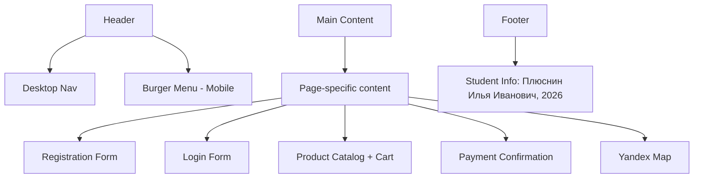
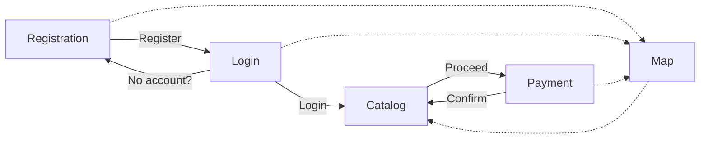

# Ice Cream Shop Website - Development Plan

## Project Overview
A lightweight, frontend-focused ice cream shop website with 5 pages, responsive design, and interactive features.

**Important: All website content must be in Russian language.**

## Technical Stack
- **HTML5** - Semantic markup
- **CSS3** - Styling with Flexbox/Grid, responsive design
- **JavaScript** - Interactivity, drag-and-drop, form validation
- **Yandex Maps API** - Location map

## Project Structure

```
ice-cream-shop/
├── index.html              # Redirect to catalog or login
├── registration.html       # User registration page
├── login.html              # User login page
├── catalog.html            # Product catalog with cart
├── payment.html            # Order confirmation page
├── map.html                # Yandex map with address
├── css/
│   └── styles.css          # Main stylesheet
├── js/
│   └── main.js             # Main JavaScript file
├── images/
│   ├── favicon.ico         # Site icon
│   ├── vanila.jpg          # Vanilla ice cream
│   ├── chocolate.jpg       # Chocolate ice cream
│   ├── strawberry.jpg      # Strawberry ice cream
│   ├── mint.jpg            # Mint ice cream
│   └── caramel.jpg         # Caramel ice cream
└── plans/
    └── ice-cream-shop-plan.md
```

## Page Descriptions

### 1. Registration Page (registration.html)
- Form fields: Name, Email, Password, Confirm Password
- Form validation with JavaScript
- Visual feedback for errors
- Link to login page
- Minimalistic design

### 2. Login Page (login.html)
- Form fields: Email, Password
- Accepts any credentials (visual only)
- Redirect to catalog on submit
- Link to registration page

### 3. Catalog Page (catalog.html)
- 5 product cards with images and prices
- Drag-and-drop functionality to cart
- Cart section showing:
  - Product names
  - Individual prices (100₽ each)
  - Total order sum
- Clear cart button
- Proceed to payment button

### 4. Payment Page (payment.html)
- Order summary from cart
- Simple confirmation message
- Thank you message after confirmation
- Return to catalog button

### 5. Map Page (map.html)
- Yandex Maps integration
- Marker at: Moscow, Vernadsky Avenue 78, building 4, 119454
- Contact information

## Responsive Design Strategy

### Desktop (≥768px)
- Horizontal navigation in header
- Product cards in grid layout (3-5 columns)
- Cart as sidebar or fixed section

### Mobile (<768px)
- Burger menu with slide-out navigation
- Single column product layout
- Cart at bottom or collapsible

## Component Architecture



## Navigation Flow



## Product Data

| Product | Image | Price |
|---------|-------|-------|
| Ванильное | vanila.jpg | 100₽ |
| Шоколадное | chocolate.jpg | 100₽ |
| Клубничное | strawberry.jpg | 100₽ |
| Мятное | mint.jpg | 100₽ |
| Карамельное | caramel.jpg | 100₽ |

## CSS Architecture

### Color Scheme (Minimalistic)
- Primary: #FF6B6B (soft coral/red - ice cream theme)
- Secondary: #4ECDC4 (mint/teal)
- Background: #FFFFFF (white)
- Text: #2C3E50 (dark blue-gray)
- Accent: #F7DC6F (soft yellow)

### Breakpoints
- Mobile: < 768px
- Desktop: ≥ 768px

## JavaScript Features

1. **Burger Menu Toggle**
   - Open/close mobile navigation
   - Close on link click
   - Close on outside click

2. **Drag and Drop**
   - Draggable product cards
   - Drop zone in cart
   - Visual feedback during drag

3. **Cart Management**
   - Add items to cart
   - Calculate total
   - Clear cart
   - Persist in sessionStorage

4. **Form Validation**
   - Email format check
   - Password match verification
   - Required field validation

5. **Page Navigation**
   - Smooth transitions
   - Active state highlighting

## Yandex Maps Integration

```javascript
// Initialize map centered on the address
const map = new ymaps.Map('map', {
    center: [55.680817, 37.507628], // Approximate coordinates
    zoom: 16
});

// Add placemark
const placemark = new ymaps.Placemark([55.680817, 37.507628], {
    balloonContent: 'Магазин мороженого<br>пр. Вернадского, 78, стр. 4'
});
```

## Accessibility Considerations
- Semantic HTML elements
- ARIA labels for interactive elements
- Keyboard navigation support
- Focus indicators
- Alt text for images

## Browser Support
- Chrome (latest)
- Firefox (latest)
- Safari (latest)
- Edge (latest)
- Mobile browsers (iOS Safari, Chrome Mobile)

## Files to Create

| File | Purpose |
|------|---------|
| `index.html` | Entry point, redirects to login |
| `registration.html` | Registration form |
| `login.html` | Login form |
| `catalog.html` | Main shop with products and cart |
| `payment.html` | Order confirmation |
| `map.html` | Store location map |
| `css/styles.css` | All styles |
| `js/main.js` | All JavaScript logic |

## Implementation Order

1. Create folder structure and move images
2. Create base CSS styles (reset, variables, typography)
3. Create header and footer components
4. Build each page with HTML
5. Add responsive styles
6. Implement JavaScript functionality
7. Integrate Yandex Maps
8. Test across devices and browsers
9. Final polish and adjustments
